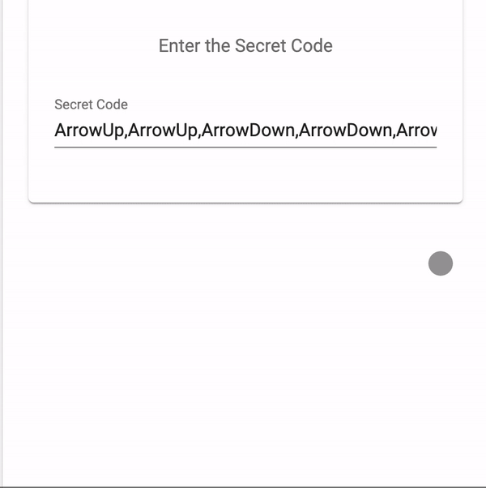

# ng-konami #

[](https://www.npmjs.com/package/ng-konami/)
[](https://www.npmjs.com/package/ng-konami)
[](https://www.npmjs.com/package/ng-konami)



## Index ##

* [About](#about)
* [Setup](#setup)
* [Usage](#usage)
* [Documentation](#documentation)
* [Contributing](#contributing)
* [Issues](#issues)
* [Deploy](#deploy)

## About ## 

A light-weight service for handling secret codes such as [The Konami Code](https://en.wikipedia.org/wiki/Konami_Code#Variations_of_the_Konami_Code) within any Angular 2+ app.

* Try out [the demo](https://ng-konami.jrquick.com) to see it in action!
* Visit [my website](https://jrquick.com) for other cool projects!

## Setup ##

### Install Node ###

```
npm install ng-konami --save
```

### Import module ###

* Import `NgKonamiModule` by adding the following to your parent module (i.e. `app.module.ts`):

    ```
    import { NgKonamiModule } from 'ng-konami';

    @NgModule({
      ...
      imports: [
        NgKonamiModule,
        ...
      ],
      ...
    })
    export class AppModule {}
    ```

### Listen for Keyboard Events

    ```
    constructor(
      private service:NgKonamiService
    ) {
      
    }
    
    @HostListener('window:keyup', ['$event'])
    keyEvent(event:KeyboardEvent) {
      this.events.push(event);
    
      this.service.listen(event);
    }
    ```

### Register Secret Code

    ```
    constructor(
      private service:NgKonamiService
    ) {
      this.service.register(
        'ArrowUp,ArrowUp,ArrowDown,ArrowDown,ArrowLeft,ArrowRight,ArrowLeft,ArrowRight,b,a',
        () => {
          // do something
        }
      );
    }
    ```

## Documentation ##

### Functions ###

* `register()` - Register a particular sequence of keyboard characters (in CSV format).
    * Keyboard characters can be differentiated by [the KeyboardEvent's key or code](https://www.w3schools.com/jsref/obj_keyboardevent.asp)
* `listen()` - Pass the keyboard events through to listen for the secret code 
* `removeAll()` - Remove all registered codes

## Contributing ##

### Thanks ###

* [jrquick17](https://github.com/jrquick17)

## Issues ##

If you find any issues feel free to open a request in [the Issues tab](https://github.com/jrquick17/ng-konami/issues). If I have the time I will try to solve any issues but cannot make any guarantees. Feel free to contribute yourself.

## Deploy ##

### Demo ###
    
* Run `npm install` to get packages required for the demo and then run `npm run demo` to run locally.

### Generate Docs ###

* Run `npm run docs:build`

#### Update Version ###
    
* Update version `package.json` files in both the root and `dist/` directory following [Semantic Versioning (2.0.0)](https://semver.org/).

### Build ###

* Run `npm run build` from root.

#### Test ####

* Copy `dist/` contents into `demo/node_modules/ng-konami/`
    * Run from root:  `cp -fr dist/* demo/node_modules/ng-konami/`
* Run `ng serve` from `demo/`
* Run `ng build --prod` from `demo/`

#### NPM Release ####

* Run `npm publish` from `dist/` directory.

#### Update Changelog ####

* Add updates to `CHANGELOG.md` in root.
